# EMIS Unit · Thapathali Campus (IOE, TU)


**Phone:** +977-1-5971479  
**Location:** Thapathali Campus, Institute of Engineering (IOE), Tribhuvan University

---

## 👋 About Us

The **Education Management Information System (EMIS)** Unit is the digital backbone of **Thapathali Campus**. We collect and analyze institutional data, operate networking and server infrastructure, and support every department in adopting technology for efficient, evidence-based decision making.

---

## 🎯 Main Objectives

- **Data & Analytics:** Collect, curate, and analyze data about people (teachers, staff, students) and material resources on campus.
- **ICT Leadership:** Manage campus ICT and establish EMIS as the **Information & Communication Center**.
- **Process Digitization:** Prepare and streamline the work of every department/branch through computer technology.
- **Library Modernization:** Computerize the library and operate a robust **E-Library**.
- **Connectivity & Web:** Organize and maintain reliable **internet services** and the **campus website**.
- **Data Provisioning:** Provide required information and datasets to the Campus, **UGC**, Dean’s Office, and relevant governmental, semi-governmental, private, non-governmental, and international organizations, as needed.
- **Other EMIS Tasks:** Carry out other EMIS-related assignments as delegated.

---

## 🧑‍💼 Officials

| Name                    | Role              | Email                |
| ----------------------- | ----------------- | -------------------- |
| **Er. Shanta Maharjan** | Head of EMIS Unit | shantarup@ioe.edu.np |
| **Mr. Suman Maharjan**  | Computer Operator | suman@tcioe.edu.np   |
| **Ms. Kabira Khadka**   | Assistant         | kabira@tcioe.edu.np  |


---

## 🏗️ Networking & Infrastructure (Glance)

## 🔄 Campus Access Flow (Mermaid)

### 1) Wired/Wi‑Fi User Internet Access with Failover & VPN

```mermaid
sequenceDiagram
    autonumber
    participant U as Client User (Wired/Wi‑Fi)
    participant A as Access SW (SW1/SW2)
    participant C as Core SW (SW3)
    participant F as Firewall / DMZ
    participant I as ISP (ClassicTech 150/150)
    participant V as Site‑to‑Site VPN
    participant N as NTC Router / SIP
    participant B as NIC Asia Bank

    U->>A: DHCP Request / 802.1X (VLAN)
    A->>C: Uplink 1Gbps (UTP)
    C->>F: Route to WAN / NAT
    alt Primary Link Up
        F->>I: Internet Egress
        I-->>F: Internet Response
    else Primary Down (Failover via Huawei SW)
        F->>I: Switch to Backup ISP
        I-->>F: Internet Response (Failover)
    end
    opt VPN Destinations
        F->>V: IPSec Tunnel
        V->>N: Reach NTC Services (SIP/Router)
        V->>B: Reach Bank Services
        N-->>V: SIP/Signaling/Routes
        B-->>V: Bank App/Endpoints
        V-->>F: Encrypted Traffic
    end
    F-->>C: Return Traffic
    C-->>A: L3/L2 Forward
    A-->>U: Response to Client
```



### 2) Campus Service Consumption (On‑Prem Resources)

```mermaid
sequenceDiagram
    autonumber
    participant U as Client User (PC/Mobile)
    participant A as Access SW (SW1/SW2)
    participant C as Core SW (SW3)
    participant AC as AP Controller
    participant NVR as CCTV NVR
    participant ATT as Attendance System
    participant SRV as Application Servers (SRV01/SRV02)
    participant NAS as NAS/Storage
    participant SIP as NTC SIP Server

    U->>A: Join VLAN (Student/Staff/VoIP/CCTV)
    A->>C: 1Gbps Uplink
    par Wi‑Fi/Devices
        C->>AC: AP Mgmt / SSIDs
        AC-->>U: Auth & WLAN Access
    and CCTV
        U->>NVR: Stream/Record (via VLAN CCTV)
        NVR-->>U: Playback
    and Attendance
        U->>ATT: Punch/Sync
        ATT-->>U: Confirmation
    and App/Storage
        U->>SRV: Web/App/DB Requests
        SRV<->>NAS: File Shares/Backups
        SRV-->>U: App Response
    and IP Phone
        U->>SIP: SIP Register/Calls (VoIP VLAN)
        SIP-->>U: Call Media/Signaling
    end
```

### 3) High‑Level Campus Topology

```mermaid
graph TB
    subgraph WAN
        ISP[ClassicTech 150/150]
        VPN[Site‑to‑Site VPN]
        NTC[NTC Router & SIP]
        BANK[NIC Asia Bank]
    end

    FW[Firewall / DMZ]:::dmz
    CORE[Core Switch SW3]:::core
    SW1[Access SW1]:::access
    SW2[Access SW2]:::access
    APC[AP Controller]:::svc
    NVR[CCTV NVR]:::svc
    NAS[NAS/Storage]:::svc
    SRV01[SRV01]:::svc
    SRV02[SRV02]:::svc

    ISP --- FW
    VPN --- FW
    NTC --- VPN
    BANK --- VPN

    FW --> CORE
    CORE --> SW1
    CORE --> SW2
    CORE --> APC
    CORE --> NVR
    CORE --> NAS
    CORE --> SRV01
    CORE --> SRV02

    %% Building Uplinks (1 Gbps)
    SW1 --> CBlock[C‑Block]:::bldg
    SW1 --> Arch[Architecture]:::bldg
    SW1 --> RAC[RAC]:::bldg
    SW1 --> BBlock[B‑Block]:::bldg
    SW2 --> MLab[Machine Lab]:::bldg
    SW2 --> Library[Library]:::bldg
    SW2 --> BCTL[BCT Lab]:::bldg
    SW2 --> Canteen[Canteen]:::bldg
    SW2 --> Guard[Guard House]:::bldg
    SW2 --> Indus[Industrial (B‑Block‑TOP)]:::bldg
    SW2 --> ELib[E‑Library]:::bldg

    classDef dmz fill:#fde68a,stroke:#b45309,stroke-width:1px;
    classDef core fill:#bfdbfe,stroke:#1d4ed8,stroke-width:1px;
    classDef access fill:#e5e7eb,stroke:#374151,stroke-width:1px;
    classDef svc fill:#d1fae5,stroke:#065f46,stroke-width:1px;
    classDef bldg fill:#f3f4f6,stroke:#111827,stroke-width:1px;
```

---

## 🧩 What We Host & Operate

> Add your actual systems and links in the placeholders below.

### Core Services

- **Campus Website & CMS:** [tcioe.edu.np](https://tcioe.edu.np/)
- **E‑Library:** [elibrary.tcioe.edu.np](https://elibrary.tcioe.edu.np/)
- **Journal Portal:** [journal.tcioe.edu.np](https://journal.tcioe.edu.np/)
- **Library System:** [library.tcioe.edu.np](https://library.tcioe.edu.np/)
- **Learning Management System (LMS):** [lms.tcioe.edu.np](https://lms.tcioe.edu.np/)
- **Class Routine System:** [routine.tcioe.edu.np](https://routine.tcioe.edu.np/)

### Departmental Portals

- **Department of Automobile and Mechanical Engineering:** [doame.tcioe.edu.np](https://doame.tcioe.edu.np/)
- **Department of Architecture:** [doarch.tcioe.edu.np](https://doarch.tcioe.edu.np/)
- **Department of Applied Science:** [doas.tcioe.edu.np](https://doas.tcioe.edu.np/)
- **Department of Civil Engineering:** [doce.tcioe.edu.np](https://doce.tcioe.edu.np/)
- **Department of Electronics & Communication Engineering:** [doece.tcioe.edu.np](https://doece.tcioe.edu.np/)
- **Department of Industrial Engineering:** [doie.tcioe.edu.np](https://doie.tcioe.edu.np/)

### Student Organizations & Communities

- **Free Student Union (FSU):** [fsu.tcioe.edu.np](https://fsu.tcioe.edu.np/) - The Free Student Union (FSU) of Thapathali Engineering Campus
- **Robotics and Automation Center (RAC):** [rac.tcioe.edu.np](https://rac.tcioe.edu.np/) - Robotics and Automation center
- **ECAST:** [ecast.tcioe.edu.np](https://ecast.tcioe.edu.np/) - Electronics and Computer Community Amidst Students, Thapathali

## 🔗 Quick Links

- **Thapathali Campus (IOE, TU):** [tcioe.edu.np](https://tcioe.edu.np/)

- **UGC:** [ugcnepal.edu.np](https://ugcnepal.edu.np/)
- **E‑Library:** [elibrary.tcioe.edu.np](https://elibrary.tcioe.edu.np/)
- **Campus Website:** [tcioe.edu.np](https://tcioe.edu.np/)

---

© Thapathali Campus – EMIS Unit.
